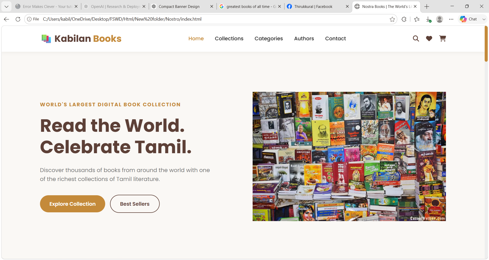

# 📚 Nostra Books

Nostra Books is a modern and responsive online bookstore website built using **HTML5, CSS3, and JavaScript**. The project provides an elegant shopping experience with a clean user interface, responsive design, and interactive features for discovering books across various genres.


## 🌐 Live Demo

👉 https://kabilanmadurai.github.io/Nostro-Books/


## 📸 Preview



---

# ✨ Features

- 📚 Modern bookstore landing page
- 🔍 Book search functionality
- 📖 Collections page with book catalog
- 🏷️ Category-based browsing
- 🎯 Filter books by:
  - Language
  - Genre
  - Price
  - Rating
- ⭐ Best Seller & Popular badges
- ❤️ Wishlist icon
- 🛒 Add to Cart buttons
- 👨‍💼 Featured authors section
- 📱 Fully responsive design
- ✨ Smooth hover animations
- 🎨 Clean and user-friendly interface

---

# 🛠️ Built With

- HTML5
- CSS3
- JavaScript (ES6)
- Google Fonts
- Font Awesome

---

# 📂 Project Structure

```
Nostra-Books/
│
├── index.html
├── collections.html
├── contact.html
├── style.css
├── script.js
│
├── images/
│   ├── banner/
│   ├── books/
│   ├── authors/
│   └── icons/
│
└── README.md
```

---

# 📱 Responsive Design

The website is optimized for:

- 💻 Desktop
- 💻 Laptop
- 📱 Tablet
- 📱 Mobile Devices

---

# 🚀 Future Enhancements

- User Login & Registration
- Shopping Cart
- Wishlist Functionality
- Book Details Page
- Dark Mode
- Payment Gateway
- Book Reviews & Ratings
- Backend Integration
- Database Support
- Admin Dashboard

---

# 📖 Learning Outcomes

This project helped strengthen my understanding of:

- Semantic HTML
- CSS Flexbox & Grid
- Responsive Web Design
- DOM Manipulation
- JavaScript Events
- Search & Filtering Logic
- UI/UX Design Principles
- Front-end Project Structuring

---

# 👨‍💻 Author

**Kabilan Baskaran**

- GitHub: https://github.com/kabilanmadurai


If you enjoyed this project, please consider giving it a **⭐ Star** on GitHub!
